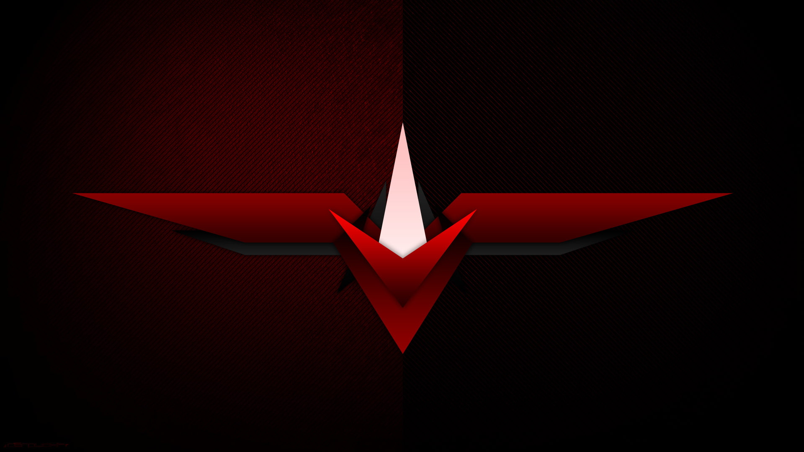

# Portfolio Flex

  

In this portfolio I use React.js 18 to showcase some of my projects I created. I use MUI 5 for styling and practice positioning with the Flexbox component.

Open [My Portfolio](https://mikeys.netlify.app/) to view it in your browser.

## 🧐 What's inside?

A quick look at the sections you'll see in this React project.

1.  **`SkyRed Productions:`**

2.  **`Cards Redux:`**

3.  **`Bounty Hunters:`**

4.  **`Slot Machine:`**

5.  **`High Card:`**

6.  **`Sienar Fleet Systems:`**

 
 
<h2 align="center">
  &copy; 2022 Michael Saucedo
</h2>
